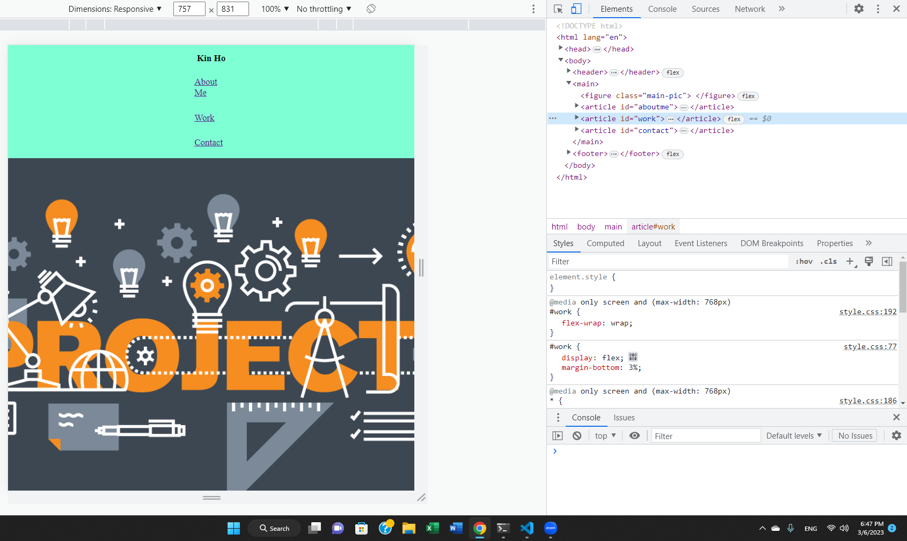

# Homework #2

# Description

- My motivation was to learn and sharpen my coding skills using HTML/CSS
- I build this project because I could learn how to make a webpage adapt to smaller screen sizes when it's re-sized, how to distribute flex-boxes, and how to organize a webpage.
- It definitely solved how I could distribute the flex boxes evenly. I had no idea how to do it before and stuck there for hours.
- I learned lots of new elements and properties such as flex-basis, :: hover, media screen only, etc.

## Installation

- Cloned with github.
- Created assets folder, HTML, and CSS files.
- Organize how to distribute flex boxes.
- Copy images from Google.
- Used CSS to style the page and add links.
- Added README file.
- Git push everything to Github.
- Deployed application.

## Usage

# Credits

- https://d2slcw3kip6qmk.cloudfront.net/marketing/blog/2017Q2/project-planning-header@2x.png.
- https://images.businessnewsdaily.com/app/uploads/2022/04/04073619/how-ecommerce-works.png.
- https://www.itu.int/itu-d/sites/statistics/wp-content/uploads/sites/11/2021/03/ICTprices.jpg.
- https://fscl01.fonpit.de/userfiles/7687254/image/NextPit_Apps-w1400h1050.jpg.

# License

MIT License

Copyright (c) [year] [fullname]

Permission is hereby granted, free of charge, to any person obtaining a copy
of this software and associated documentation files (the "Software"), to deal
in the Software without restriction, including without limitation the rights
to use, copy, modify, merge, publish, distribute, sublicense, and/or sell
copies of the Software, and to permit persons to whom the Software is
furnished to do so, subject to the following conditions:

The above copyright notice and this permission notice shall be included in all
copies or substantial portions of the Software.

THE SOFTWARE IS PROVIDED "AS IS", WITHOUT WARRANTY OF ANY KIND, EXPRESS OR
IMPLIED, INCLUDING BUT NOT LIMITED TO THE WARRANTIES OF MERCHANTABILITY,
FITNESS FOR A PARTICULAR PURPOSE AND NONINFRINGEMENT. IN NO EVENT SHALL THE
AUTHORS OR COPYRIGHT HOLDERS BE LIABLE FOR ANY CLAIM, DAMAGES OR OTHER
LIABILITY, WHETHER IN AN ACTION OF CONTRACT, TORT OR OTHERWISE, ARISING FROM,
OUT OF OR IN CONNECTION WITH THE SOFTWARE OR THE USE OR OTHER DEALINGS IN THE
SOFTWARE.

